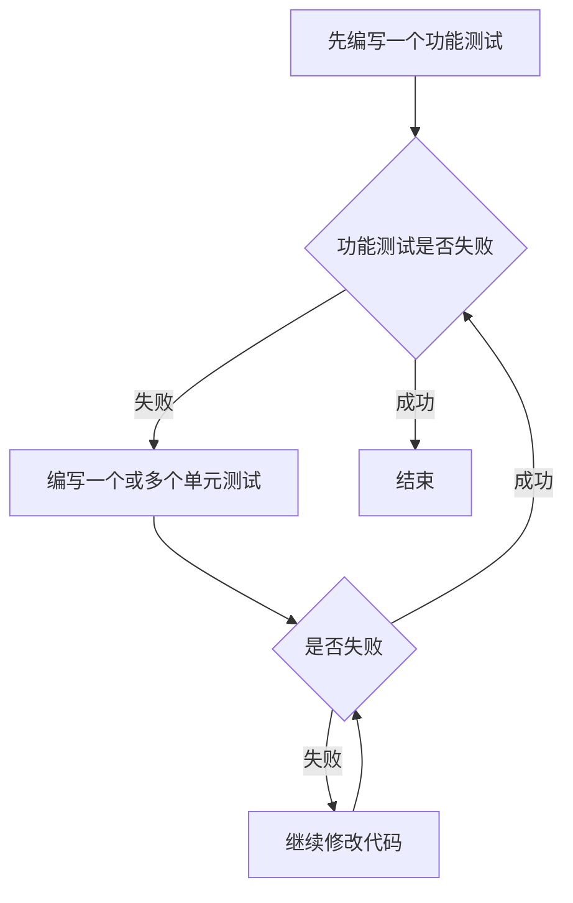
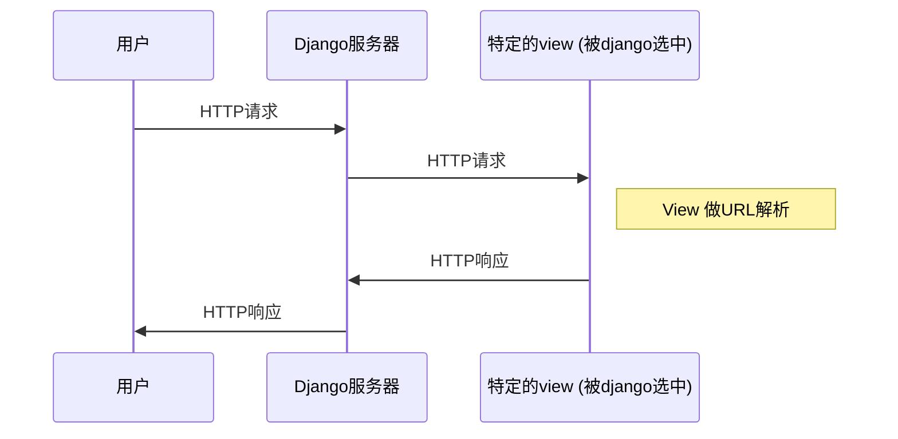

# 第一节

#### 知识收获
1. 前导性知识
2. TDD的概念，即测试驱动编程（先写测试然后编程）
3. 如何使用selenium对WEB应用进行初步的测试
#### 需要记住的命令

1. django开启一个project
```
django-admin.py startproject superlists
```
2. django开启对应的项目服务
```
python manage.py runserver
```

# 第二节
#### 知识性收获

1. 功能测试(Functional Test)==验收测试(Acceptance Test)==端到端测试(End-to-End Test)==黑盒测试(Black Box Test)
2. **功能测试**：**面向用户的、从外部测试应用程序**，在创建功能测试时应该先编写User Story，然后按照User Story进行开发。
* Functional tests should help you build an application with the right functionality, and guarantee you never accidentally break it.
3. **单元测试**：**面向编程者、从内部测试应用程序。**
* Unit tests should help you to write code that’s clean and bug free.
4. TDD测试的工作流程：


5. python unittest标准库
  * setUp()
  * 测试之前运行
  * tearDown()
  * 测试之后运行(**即使出现错误**)
  * test_...()
  * 任何以test开头的方法都是测试方法，将由测试器运行
  * assertIn|assertEqual|assertTrue|assertFalse
  * 代替原生的assert语句
6. Django的模式
  1. Django是按照经典的MVC模式构建的、但是它的视图更像是一个控制器
  2. Django的主要工作与别的Web服务器一样，响应用户对网站特定URL的访问
  3. Django工作流程：



#### 需要记住的代码


* Django开始一个app
  * `python manage.py startapp lists`
* unittest类如何使用
```python
from selenium import webdriver
import unittest

class NewVisitorTest(unittest.TestCase):

def setUp(self):
self.browser = webdriver.Chrome()

def tearDown(self):
self.browser.quit()

def test_can_start_a_list_and_retrieve_it_later(self):
self.browser.get('http://localhost:8000')
self.assertIn('To-Do',self.browser.title)
self.fail("Finish the test!")

if __name__ == '__main__':
unittest.main(warnings='ignore')
```

# 第三节 单元测试
  本节举例如何在Django app中做单元测试，以及用大量例子说明了TDD测试的流程（单元测与功能测之间的关系）、以及单元测试的“满工出细活”本性。
#### 知识性收获

1. 在Django 的app中有一个tests.py，可在其中编写自己的单元测试代码，需要编写继承自django.test包中的TestCase类的自定义类
2. django.urls 包中的 resolve(‘urlname’)用于解析url参数、并返回Django用于解析此url的view对象，view对象在app中的views下定义。
3. resolve('urlname')方法需要URL mapping才能起作用、Django将之放在了project目录下的urls.py中
  1. 当调用resolve('urlname')方法时，系统会自动从mapping中查找
  2. url条目以正则表达式开头，该表达式定义它应用于哪些URL，然后继续说明它应该将这些请求发送到哪里 - 要么是导入的视图**函数**(可调用的python对象)，要么是其他地方的另一个urls.py文件。
  1. 如：`url(r'^$', views.home_page, name='home')`

4. 对比上一小节中的Django工作流程：
  1. HttpRequest()可以返回一个模拟的请求对象。
  2. HttpResponse()可以返回一个响应对象，可以使用该对象定义返回的元素。
  3. Request对象一般会被交给对应的view处理，并返回对应的Response对象。

#### 需要记住的

1. git commit -am is the quickest formulation, but also gives you the **least feedback** about what’s being committed, so make sure you’ve done a git status and a git diff beforehand, and are clear on what changes are about to go in.
2. TDD琐碎而繁琐的步骤可以根据情况简化
3. 为什么需要如此琐碎的测试？
  1. Having a test there for a simple function means it’s that much less of a psychological barrier to overcome when the simple function gets a tiny bit more complex—perhaps it grows an if. Then a few weeks later it grows a for loop. Before you know it, it’s a recursive metaclass-based polymorphic tree parser factory. But because it’s had tests from the very beginning, adding a new test each time has felt quite natural, and it’s well tested.
  2. 大意：现在做的微小的测试工作能够很好的为将来复杂的函数打好基础，当复杂函数出现问题时，经过如此多的测试，问题可以很快的被解决。


