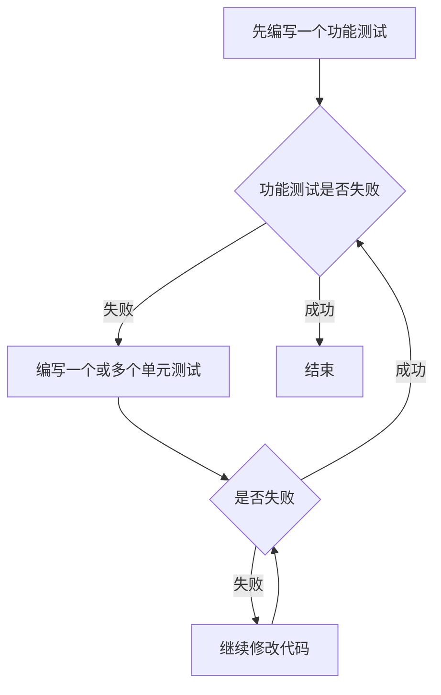
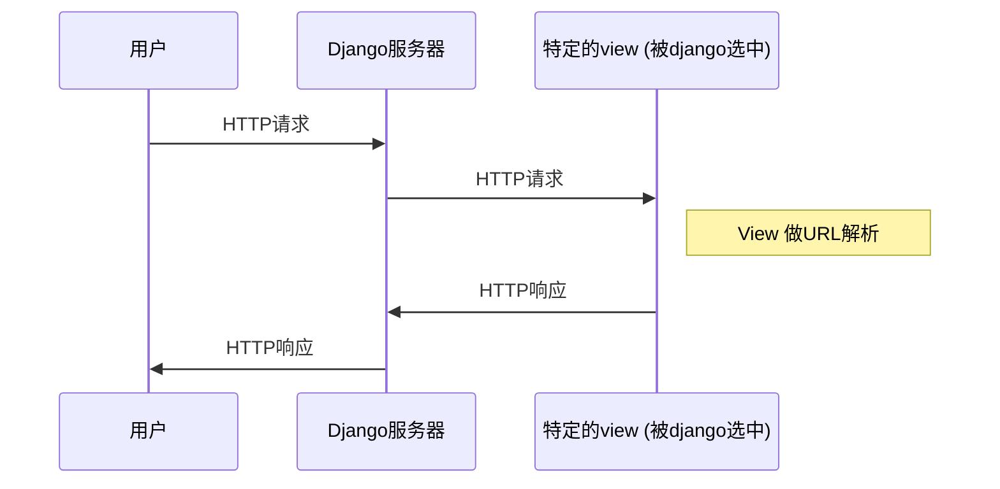

# 第一节

#### 知识收获
1. 前导性知识
2. TDD的概念，即测试驱动编程（先写测试然后编程）
3. 如何使用selenium对WEB应用进行初步的测试
#### 需要记住的命令

1. django开启一个project
```
django-admin.py startproject superlists
```
2. django开启对应的项目服务
```
python manage.py runserver
```

# 第二节
#### 知识性收获

1. 功能测试(Functional Test)==验收测试(Acceptance Test)==端到端测试(End-to-End Test)==黑盒测试(Black Box Test)
2. **功能测试**：**面向用户的、从外部测试应用程序**，在创建功能测试时应该先编写User Story，然后按照User Story进行开发。
    * Functional tests should help you build an application with the right functionality, and guarantee you never accidentally break it.
3. **单元测试**：**面向编程者、从内部测试应用程序。**
    * Unit tests should help you to write code that’s clean and bug free.
4. 测试的工作流程：


5. python unittest标准库
    * setUp()
        * 测试之前运行
    * tearDown()
        * 测试之后运行(**即使出现错误**)
    * test_...()
        * 任何以test开头的方法都是测试方法，将由测试器运行
    * assertIn|assertEqual|assertTrue|assertFalse
        * 代替原生的assert语句
6. Django的模式
    1. Django是按照经典的MVC模式构建的、但是它的视图更像是一个控制器
    2. Django的主要工作与别的Web服务器一样，响应用户对网站特定URL的访问
    3. 工作流程：
        


#### 需要记住的代码
   

* Django开始一个app
    * `python manage.py startapp lists`
* unittest类如何使用
```python
from selenium import webdriver
import unittest

class NewVisitorTest(unittest.TestCase):

    def setUp(self):
        self.browser = webdriver.Chrome()

    def tearDown(self):
        self.browser.quit()

    def test_can_start_a_list_and_retrieve_it_later(self):
        self.browser.get('http://localhost:8000')
        self.assertIn('To-Do',self.browser.title)
        self.fail("Finish the test!")

if __name__ == '__main__':
    unittest.main(warnings='ignore')
```


        
     


 
